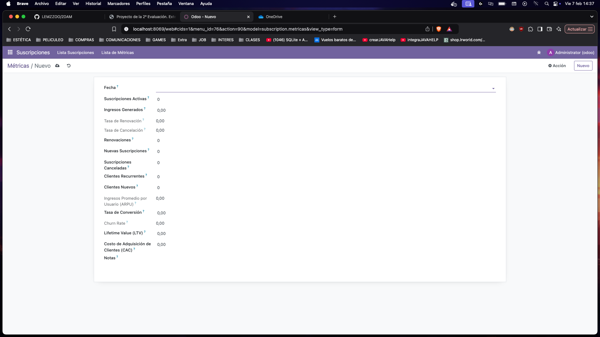
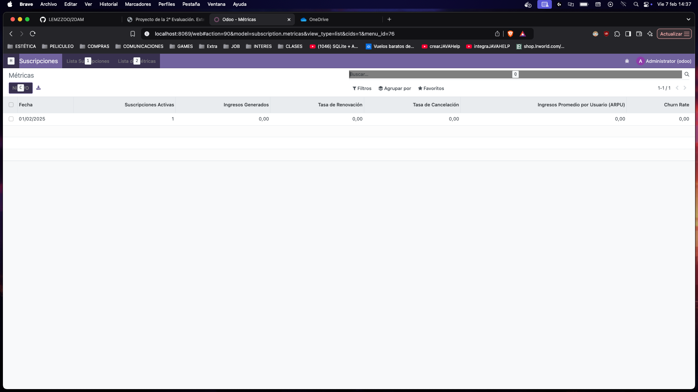

# MODIFICACIONES EXTRA AL MODELO SUSCRIPTION PARA LAS METRICAS:

### Antes de nada siempre descomento el fichero access en manifest.

## Actualizar ir.mode..access.csv, hay que añadir el nuevo modelo.
### Añadir la siguiente linea al final.

```css
access_subscription_metricas,subscription.metricas,model_subscription_metricas,base.group_user,1,1,1,1
```
## init.py

## Modulo Metricas

 ```python
from odoo import models, fields, api

class MetricasSuscripcion(models.Model):
    _name = 'subscription.metricas'
    _description = 'Métricas de Suscripciones'

    fecha = fields.Date(string='Fecha', required=True)
    suscripciones_activas = fields.Integer(string='Suscripciones Activas', required=True)
    ingresos_generados = fields.Float(string='Ingresos Generados', required=True)
    tasa_renovacion = fields.Float(string='Tasa de Renovación', compute='_compute_tasas', store=True)
    tasa_cancelacion = fields.Float(string='Tasa de Cancelación', compute='_compute_tasas', store=True)
    renovaciones = fields.Integer(string='Renovaciones', required=True)
    nuevas_suscripciones = fields.Integer(string='Nuevas Suscripciones', required=True)
    suscripciones_canceladas = fields.Integer(string='Suscripciones Canceladas', required=True)
    clientes_recurrentes = fields.Integer(string='Clientes Recurrentes', required=True)
    clientes_nuevos = fields.Integer(string='Clientes Nuevos', required=True)
    arpu = fields.Float(string='Ingresos Promedio por Usuario (ARPU)', compute='_compute_arpu', store=True)
    tasa_conversion = fields.Float(string='Tasa de Conversión')
    churn_rate = fields.Float(string='Churn Rate', compute='_compute_churn', store=True)
    ltv = fields.Float(string='Lifetime Value (LTV)')
    cac = fields.Float(string='Costo de Adquisición de Clientes (CAC)')
    notas = fields.Text(string='Notas')
    suscripcion_ids = fields.One2many(
        comodel_name='subscription.suscripcion', 
        inverse_name='metricas_id', string='Suscripciones')

    @api.depends('renovaciones', 'suscripciones_activas', 'suscripciones_canceladas')
    def _compute_tasas(self):
        for self in self:
            self.tasa_renovacion = (self.renovaciones / self.suscripciones_activas * 100) if self.suscripciones_activas else 0
            self.tasa_cancelacion = (self.suscripciones_canceladas / self.suscripciones_activas * 100) if self.suscripciones_activas else 0

    @api.depends('ingresos_generados', 'suscripciones_activas')
    def _compute_arpu(self):
        for self in self:
            self.arpu = (self.ingresos_generados / self.suscripciones_activas) if self.suscripciones_activas else 0

    @api.depends('suscripciones_canceladas', 'suscripciones_activas')
    def _compute_churn(self):
        for self in self:
            self.churn_rate = (self.suscripciones_canceladas / self.suscripciones_activas * 100) if self.suscripciones_activas else 0
 ```

## views.xml

```xml
<?xml version="1.0" encoding="UTF-8"?>
<odoo>
    <record id="view_subscription_form" model="ir.ui.view">
        <field name="name">subscription.suscripcion.form</field>
        <field name="model">subscription.suscripcion</field>
        <field name="arch" type="xml">
            <form string="Suscripción">
                <sheet>
                    <group>
                        <field name="name"/>
                        <field name="customer_id"/>
                        <field name="subscription_code"/>
                    </group>
                    <notebook>
                        <page string="Detalles">
                            <group>
                                <field name="start_date"/>
                                <field name="end_date"/>
                                <field name="renewal_date"/>
                                <field name="duration_months"/>
                                <field name="status" widget="radio"/>
                                <field name="is_renewable"/>
                                <field name="auto_renewal"/>
                                <field name="price" attrs="{'invisible': [('status', '=', 'cancelled')]}"/>
                            </group>
                        </page>
                        <page string="Uso">
                            <group>
                                <field name="usage_limit"/>
                                <field name="current_usage"/>
                                <field name="use_percent" decoration-danger="use_percent > 80"/>
                            </group>
                        </page>
                    </notebook>
                </sheet>
            </form>
        </field>
    </record>

    <record id="view_subscription_tree" model="ir.ui.view">
        <field name="name">subscription.suscripcion.tree</field>
        <field name="model">subscription.suscripcion</field>
        <field name="arch" type="xml">
            <tree string="Suscripciones">
                <field name="name"/>
                <field name="customer_id"/>
                <field name="subscription_code"/>
                <field name="start_date"/>
                <field name="end_date"/>
                <field name="status"/>
            </tree>
        </field>
    </record>

    <record id="action_subscription" model="ir.actions.act_window">
        <field name="name">Suscripciones</field>
        <field name="res_model">subscription.suscripcion</field>
        <field name="view_mode">tree,form</field>
        <field name="view_id" ref="view_subscription_tree"/>
    </record>


    <record id="view_metricas_form" model="ir.ui.view">
        <field name="name">subscription.metricas.form</field>
        <field name="model">subscription.metricas</field>
        <field name="arch" type="xml">
            <form string="Métricas de Suscripción">
                <sheet>
                    <group>
                        <field name="fecha"/>
                        <field name="suscripciones_activas"/>
                        <field name="ingresos_generados"/>
                        <field name="tasa_renovacion"/>
                        <field name="tasa_cancelacion"/>
                        <field name="renovaciones"/>
                        <field name="nuevas_suscripciones"/>
                        <field name="suscripciones_canceladas"/>
                        <field name="clientes_recurrentes"/>
                        <field name="clientes_nuevos"/>
                        <field name="arpu"/>
                        <field name="tasa_conversion"/>
                        <field name="churn_rate"/>
                        <field name="ltv"/>
                        <field name="cac"/>
                        <field name="notas"/>
                    </group>
                </sheet>
            </form>
        </field>
    </record>

    <record id="view_metricas_tree" model="ir.ui.view">
        <field name="name">subscription.metricas.tree</field>
        <field name="model">subscription.metricas</field>
        <field name="arch" type="xml">
            <tree string="Métricas de Suscripciones">
                <field name="fecha"/>
                <field name="suscripciones_activas"/>
                <field name="ingresos_generados"/>
                <field name="tasa_renovacion"/>
                <field name="tasa_cancelacion"/>
                <field name="arpu"/>
                <field name="churn_rate"/>
            </tree>
        </field>
    </record>

    <record id="action_metricas" model="ir.actions.act_window">
        <field name="name">Métricas</field>
        <field name="res_model">subscription.metricas</field>
        <field name="view_mode">tree,form</field>
        <field name="view_id" ref="view_metricas_tree"/>
    </record>

    <menuitem id="menu_subscription_root" name="Suscripciones"/>

    <menuitem id="menu_subscription_list" name="Lista Suscripciones" 
              parent="menu_subscription_root" 
              action="action_subscription"/>

    <menuitem id="menu_metricas_list" name="Lista de Métricas" 
          parent="menu_subscription_root" 
          action="action_metricas"/>
   
</odoo>

```



