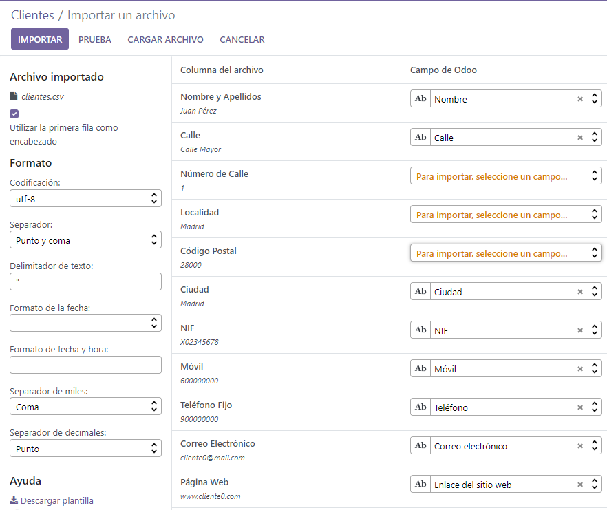
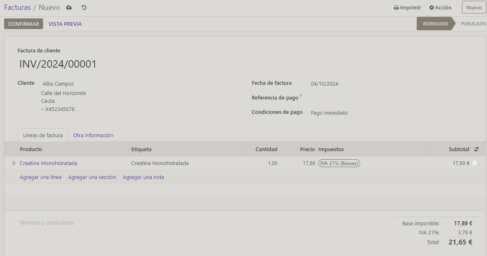

# PRACTICA 301 - FACTURAS CON ODOO

## PASOS A SEGUIR
## Meter los datos de la empresa
**Yo empiezo con la creacion del logo, hay que configurar varias cosas**
___
>## CREACION LOGO

1. Layout
2. Fuente
3. Logo de la empresa (en mi caso subi una foto)
4. Elegir un eslogan, lo suyo es que tenga que ver con los valores de la empresa.
5. Añademos detalles si queremos
Footer: El pie de pagina, podemos poner por ejemplo el email de la empresa.
___

>## COMPLETAMOS DATOS EMPRESA
**Es lo primero que te piden, *Company Data* Simplemente tenemos que rellenar los datos que nos piden, no tiene mas.**

### Por ultimo creamos la factura en el ultimo apartado, pero antes de esto hay que crear un usuario para el que vamos a emitir la factura.

___

## CREACION USUARIO
Vamos arriba a la irzquierda y le damos a *ajustes*.

En ajustes tenemos varias opciones, nos interesa la de *Opciones generales* dentro de esta opción nos fijaremos en el apartado *Usuarios*, esta parte tiene una parte que dice **Gestionar usuarios**, le damos.

Le damos nuevo y rellenamos los datos del usuario.

**Ajustes importantes**
- Contabilidad, es un cliente nos interesa asignarle solos los permisos de *facturación*.
- En Administracion le damos *Permisos de acceso*.
- En preferencias le ponemos el idioma correspondiente.
- Tambien podemos elegir por donde le llega la notificación, por odoo o por email.
___
> ## IMPORTAR USUARIOS
**Esto es muy interesante si ya tenemos una base de datos de usuarios.**

Dentro de usuarios le damos a *favoritos*  -> *importar registros* -> *SUBIR ARCHIVO*

Seleccionamos el archivo csv o el excel.

Al importar nos va a mostrar una vista previa del archivo con los campos y los datos.

Si estamos conformes le damos arriba a la izquierda a *Importar*.
___
> ## IMPORTAR CLIENTES
Esto es lo que nos interesa en este caso, desde facturación le damos a **clientes** -> favoritos e importar registros -> *subir archivo*

---
>## INICIAR SESIÓN CON EL USUARIO

Simplemente tenemos que seleccionar el usuario y darle a la tuerca que nos aparecera, le cambiamos la contraseña en *cambiar contraeña*.

Iniciamos sesión con los datos del usuario.

>## CREAR FACTURA
### Una vez importados los clientes podemos crear la factura

Como se ve en la imagen, es simplemente rellenar.
Con completar los campos
- Cliente
- Fecha de la factura
- Elegimos un producto y le ponemos precio.
* Si tuvieramos un producto añadido seria simplemente seleccionadrlo, que es lo suyo.

