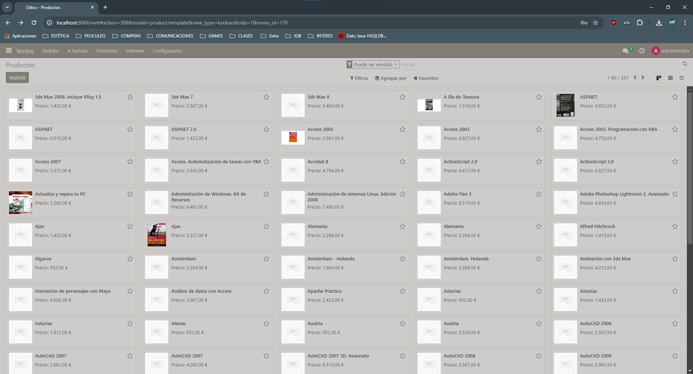

># CREACIÓN DE PRODUCTOS CON IMAGENES

## Qué necesitamos?
1. Una Api
2. Configurar un nuevo buscador de google.
3. Configurar Odoo para que pueda usar el buscador.

>## Tenemos que ir a https://console.cloud.google.com/apis/ 
### Creamos un proyecto
Despues de crear el proyecto vamos a "credenciales" y creamos una api con la primera opción "Clave Api". Tenemos que guardar la clave para copiarla despues en Odoo.

Vamos ir a "bilbioteca" y buscamos "Custom Search Api" y lo habilitamos.

># Configurar el buscador
 
Vamos a ir a https://programmablesearchengine.google.com.
Te damos a "buscar en toda la web".
Creamos un nuevo buscador marcando las casillas "Búsquema por imágenes" y "Búsquema segura".
Ya tenemos creado el buscador, ahora le damos a "personalizar" y copiamos el "ID del buscador".

># Configurar Odoo para usar el buscador
Vamos a "ajustes" y marcamos la opción "integraciones", guardamos y nos aparecen dos campos, "Clave Api" e "ID de motor de búsqueda", pegamos en cada uno lo que le corresponde y vamos a productos.

># Introducir imagenes a los productos
En este caso ya tenemos una libreria de productos asi que la importamos.

Seleccionamos un producto y le damos a acciones -> "otener imágenes de google imágenes" -> "Obtener imágenes".

Si encuentra la imagen la añade y si no nos muestra un mensaje de error.

