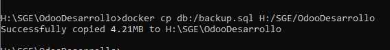
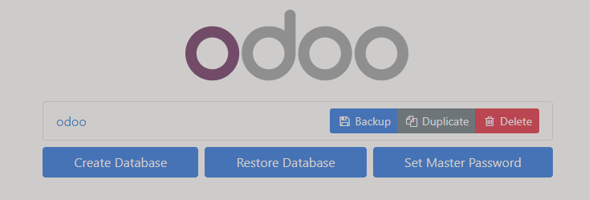
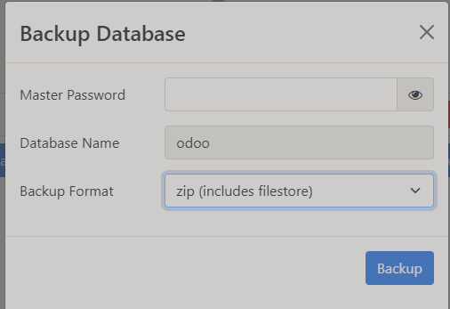
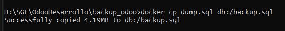
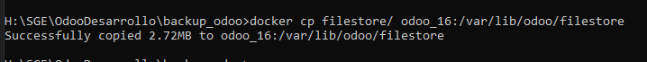

># PR0303: Integración de servicios externos

>## Copia de seguridad con `pg_dump`
Estos son los pasos a seguir:

### Antes de nada entramos al contenemos para ejecutar los comandos.

`docker-compose exec [nombre_base_datos] bash`

### Primero detenemos el servicio
`service postgresql stop`

Para crear la copia de seguridad

`pg_dumb -U db_user db_name > backup.sql`

`pg_dumb -U odoo (el nombre que le damos al crearla) > backup.sql` 

Ahora toca sacar el archivo de copia del contenedor.

`docker cp odoo:ruta_contenedor ruta_anfitrión`

En mi caso lo dejo en la carpeta OdooDesarrollo

`docker cp db:/backup.sql G:/SGE/OdooDesarrollo`

Despues de hacer la copia de seguridad, borramos todo el contenido de las carpetas dataPG, sessions, filestore y addons.

Creo nuevamente los contenedores con docker compose, comprobamos que el servidor no tenga datos y restauramos la copia de seguridad para comprobar que funciona.

Ahora hacemos el paso inverso para restaurar la copia.
`docker cp G:/SGE/OdooDesarrollo db:/var/lib/postgresql/data`

### Restautación
Para restaurar la copia de seguridad

`psql -U db_user db_name < backup.sql`

En mi caso seria `psql -U odoo odoo < backup.sql`

Volvemos arrancar el servicio
`service postgresql start`

## Copia desde la interfaz Gráfica

vamos a "http://localhost:8069/web/database/manager"

Le damos a "Backup" 

Le decimos la contraseña que usamos al crear la base de datos, tambien podemos elegir si incluir el filestore o no, nos descarga un "zip" que podemos usar para restaurar el Odoo tal y como estaba.

## Restaurar

Usamos este comando para copiar el .sql a la base de datos:

`docker cp /ruta/a/backup.sql db:/backup.sql`

Restauramos la base de datos desde el contenedor, para eso entramos en el contenedor como hicimos en el principio.

`psql -U db_user db_name < backup.sql`

En mi caso seria `psql -U odoo odoo < backup.sql`

### Copiar el Filestore

## Reiniciamos para que los cambios se refrejen correctamente

`docker-compose restart odoo`
