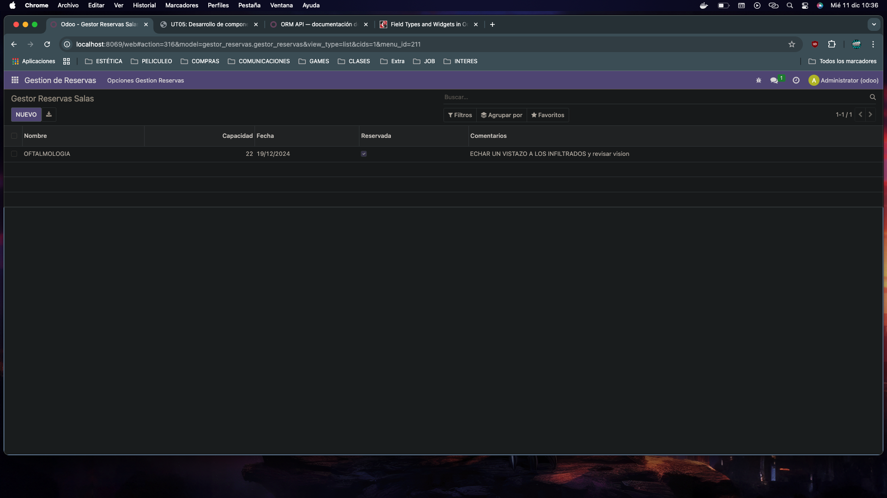

# GESTOR DE TAREAS

## Pasos para crear el modulo

Ejecutamos el código desde el contenedor para crear la base (la estructura inicial de carpetas i ficheros para el modulo):

``` odoo scaffold gestor_reservas /mnt/extra-addons/ ```

Modificamos los ficheros 'manifest', 'models', y 'views'

##  MANIFEST

```python 
{
    'name': "gestor_reservas",

    'summary': 'Módulo para gestionar la reserva de salas.',
    'description': 'Permite gestionar la reserva de salas de una empresa.',

    'author': "Lamine Sane",
    'website': "https://lemzzoo.github.io/sge_ls/",
    'applicaton': True,
    'category': 'Productivity',
    'version': '0.1',
    'depends': ['base'],
    'data': [
        'security/ir.model.access.csv',
        'views/views.xml',
        'views/templates.xml'
    ]
}
```

##  MODELS

```python 
from odoo import models, fields, api


class gestor_reservas(models.Model):
    _name = 'gestor_reservas.gestor_reservas'
    _description = "gestor_reservas.gestor_reservas"

    nombre = fields.Char()
    capacidad = fields.Integer()
    fecha = fields.Date()
    reservada = fields.Boolean()
    comentarios = fields.Char()
```

## VIEWS

```xml 
<odoo>
  <data>
    <!-- explicit list view definition -->

    <record model="ir.ui.view" id="lista_tareas.list">
      <field name="name">gestor_reservas list</field>
      <field name="model">gestor_reservas.gestor_reservas</field>
      <field name="arch" type="xml">
        <tree>
          <field name="nombre"/>
          <field name="capacidad"/>
          <field name="fecha"/>
          <field name="reservada"/>
          <field name="comentarios"/>
        </tree>
      </field>
    </record>

    <!-- actions opening views on models -->

    <record model="ir.actions.act_window" id="gestor_reservas.action_window">
      <field name="name">Gestor Reservas Salas</field>
      <field name="res_model">gestor_reservas.gestor_reservas</field>
      <field name="view_mode">tree,form</field>
    </record>

    <!-- Top menu item -->

    <menuitem name="Gestion de Reservas" id="gestor_reservas.menu_root"/>

    <!-- menu categories -->

    <menuitem name="Opciones Gestion Reservas" 
              id="gestor_reservas.menu_1" 
              parent="gestor_reservas.menu_root"/>

    <menuitem name="Salas disponibles" 
              id="gestor_reservas.menu_1_list" 
              parent="gestor_reservas.menu_1"
              action="gestor_reservas.action_window"/>

    <menuitem name="Reservas realizadas" 
              id="gestor_reservas.menu_2_list" 
              parent="gestor_reservas.menu_1"
              action="gestor_reservas.action_window"/>
  </data>
</odoo>
```



