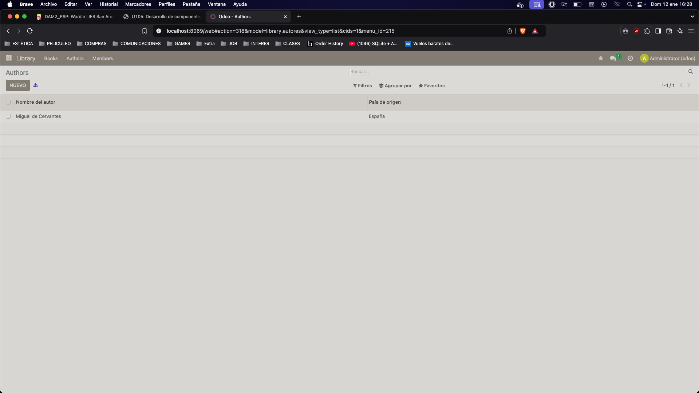
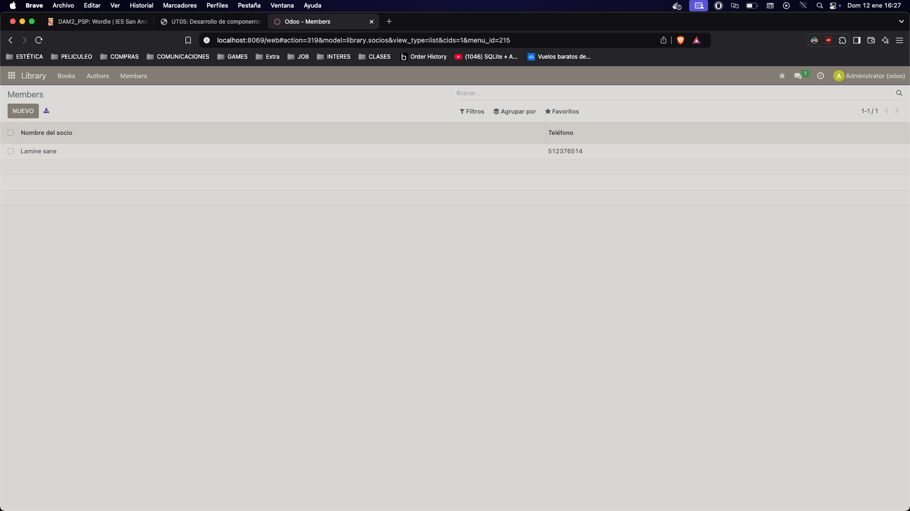

# Library_ls

### Antes de nada siempre descomento el fichero access en manifest.

## init.py

```python
from . import libros, autores, socios
```

## Autores

 ```python
# UN AUTOR PUEDE TENER VARIOS LIBROS ESCRITO POR VARIOS

from odoo import models, fields, api # type: ignore

class Autores(models.Model):
    _name = 'library.autores'
    _description = 'Modelo para la gestión de autores'

    nombre = fields.Char(
        string="Nombre del autor",
        required=True
    )
    pais_id = fields.Many2one(
        comodel_name='res.country',
        string="País de origen"
    )
    libros_ids = fields.Many2many(
        comodel_name='library.libros',
        relation='autor_libros_rel',
        column1='autor_id',
        column2='libro_id',
        string="Libros escritos por el autor"
    )
 ```


## Libros

 ```python

# UN LIBRO PUEDE SER PRESTADO A VARIOS SOCIOS (RELACION M2M A SOCIOS)

from odoo import models, fields, api # type: ignore

class Libros(models.Model):
    _name = 'library.libros'
    _description = 'Modelo para la gestión de libros'

    titulo = fields.Char(
        string="Título del libro",
        required=True
    )

    autor_ids = fields.Many2many(
        comodel_name='library.autores',
        relation='autor_libros_rel',
        column1='libro_id',
        column2='autor_id',
        string="Autores"
    )

    genero = fields.Selection(
        selection=[
            ('novela', 'Novela'),
            ('drama', 'Drama'),
            ('ciencia_ficcion', 'Ciencia Ficción'),
            ('misterio', 'Misterio'),
            ('terror', 'Terror'),
            ('historico', 'Histórico')
        ],
        string="Género del libro",
        default='Genero sin definir'
    )

    socio_ids = fields.Many2many(
        comodel_name='library.socios',
        relation='libro_socios_rel',
        column1='libro_id',
        column2='socio_id',
        string="Socios que han pedido prestado este libro"
    )
 ```


## Socios

 ```python
# UN LIBRO PUEDE SER PRESTADO A VARIOS SOCIOS

from odoo import models, fields, api # type: ignore

class Socios(models.Model):
    _name = 'library.socios'
    _description = 'Modelo para la gestión de socios'

    nombre = fields.Char(
        string="Nombre del socio",
        required=True
    )
    telefono = fields.Char(
        string="Teléfono",
        required=False
    )
    libro_ids = fields.Many2many(
        comodel_name='library.libros',
        relation='libro_socios_rel',
        column1='socio_id',
        column2='libro_id',
        string="Libros que ha pedido prestado"
    )
 ```


## ir.model.access.csv

 ```css
id,name,model_id:id,group_id:id,perm_read,perm_write,perm_create,perm_unlink
access_library_libros,access_library_libros,model_library_libros,base.group_user,1,1,1,1
access_library_autores,access_library_autores,model_library_autores,base.group_user,1,1,1,1
access_library_socios,access_library_socios,model_library_socios,base.group_user,1,1,1,1
```
## views.xml

```xml
<odoo>
  <data>
    <!-- Definición de la vista de lista para libros -->
    <record model="ir.ui.view" id="view_library_books_tree">
      <field name="name">library.books.tree</field>
      <field name="model">library.libros</field>
      <field name="arch" type="xml">
        <tree>
          <field name="titulo"/>
          <field name="autor_ids"/>
          <field name="genero"/>
        </tree>
      </field>
    </record>

    <!-- Definición de la vista de formulario para libros -->
    <record model="ir.ui.view" id="view_library_books_form">
      <field name="name">library.books.form</field>
      <field name="model">library.libros</field>
      <field name="arch" type="xml">
        <form>
          <sheet>
            <group>
              <field name="titulo"/>
              <field name="autor_ids"/>
              <field name="genero"/>
              <field name="socio_ids"/>
            </group>
          </sheet>
        </form>
      </field>
    </record>

    <!-- Acción para abrir la vista de libros -->
    <record model="ir.actions.act_window" id="action_books">
      <field name="name">Books</field>
      <field name="res_model">library.libros</field>
      <field name="view_mode">tree,form</field>
    </record>

    <!-- Definición de la vista de lista para autores -->
    <record model="ir.ui.view" id="view_library_authors_tree">
      <field name="name">library.authors.tree</field>
      <field name="model">library.autores</field>
      <field name="arch" type="xml">
        <tree>
          <field name="nombre"/>
          <field name="pais_id"/>
        </tree>
      </field>
    </record>

    <!-- Definición de la vista de formulario para autores -->
    <record model="ir.ui.view" id="view_library_authors_form">
      <field name="name">library.authors.form</field>
      <field name="model">library.autores</field>
      <field name="arch" type="xml">
        <form>
          <sheet>
            <group>
              <field name="nombre"/>
              <field name="pais_id"/>
              <field name="libros_ids"/>
            </group>
          </sheet>
        </form>
      </field>
    </record>

    <!-- Acción para abrir la vista de autores -->
    <record model="ir.actions.act_window" id="action_authors">
      <field name="name">Authors</field>
      <field name="res_model">library.autores</field>
      <field name="view_mode">tree,form</field>
    </record>

    <!-- Definición de la vista de lista para socios -->
    <record model="ir.ui.view" id="view_library_partners_tree">
      <field name="name">library.partners.tree</field>
      <field name="model">library.socios</field>
      <field name="arch" type="xml">
        <tree>
          <field name="nombre"/>
          <field name="telefono"/>
        </tree>
      </field>
    </record>

    <!-- Definición de la vista de formulario para socios -->
    <record model="ir.ui.view" id="view_library_partners_form">
      <field name="name">library.partners.form</field>
      <field name="model">library.socios</field>
      <field name="arch" type="xml">
        <form>
          <sheet>
            <group>
              <field name="nombre"/>
              <field name="telefono"/>
              <field name="libro_ids"/>
            </group>
          </sheet>
        </form>
      </field>
    </record>

    <!-- Acción para abrir la vista de socios -->
    <record model="ir.actions.act_window" id="action_partners">
      <field name="name">Members</field>
      <field name="res_model">library.socios</field>
      <field name="view_mode">tree,form</field>
    </record>

    <!-- Menú principal -->
    <menuitem id="menu_library_root" name="Library" sequence="10"/>
    <menuitem id="menu_books" name="Libros" parent="menu_library_root" action="action_books"/>
    <menuitem id="menu_authors" name="Autores" parent="menu_library_root" action="action_authors"/>
    <menuitem id="menu_partners" name="Socios" parent="menu_library_root" action="action_partners"/>
  </data>
</odoo>
```