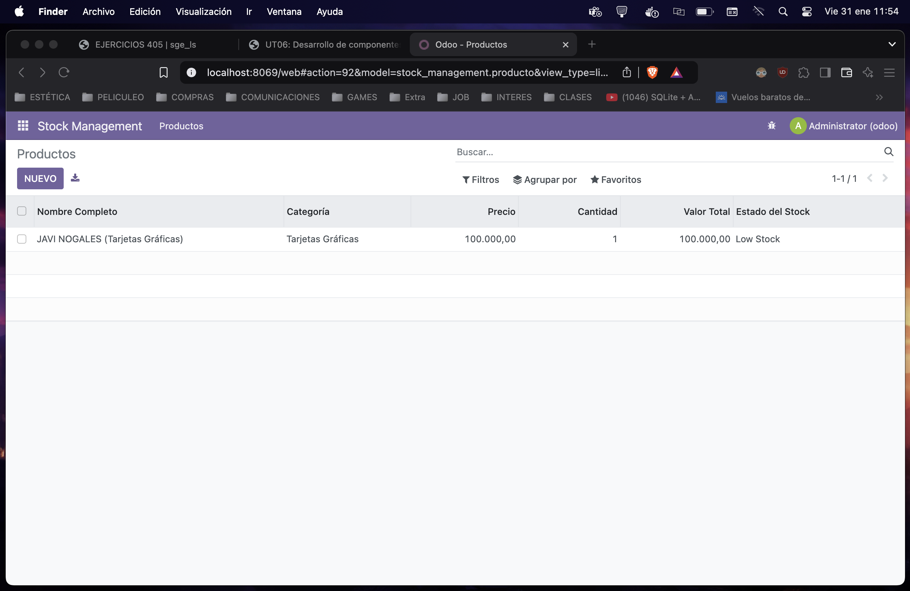

# stock_management

### Antes de nada siempre descomento el fichero access en manifest.

## init.py

```python
from . import producto
```

## Modulo Producto

 ```python
from odoo import models, fields, api
from odoo.exceptions import ValidationError

class Producto(models.Model):
    _name = 'stock_management.producto'
    _description = 'Producto en Stock'
    _sql_constraints = [
        ('name_unique', 'UNIQUE(name)', 'El nombre del producto debe ser único.'),
        ('quantity_positive', 'CHECK(quantity >= 0)', 'La cantidad en stock debe ser mayor o igual a 0.'),
        ('name_category_unique', 'UNIQUE(name, category)', 'La combinación de nombre y categoría debe ser única.'),
        ('name_length_check', 'CHECK(LENGTH(name) >= 3)', 'El nombre del producto debe tener al menos 3 caracteres.'),
    ]

    # Campos básicos
    name = fields.Char(string='Nombre del Producto', required=True)
    category = fields.Selection(
        selection=[
            ('microprocesadores', 'Microprocesadores'),
            ('tarjetas_graficas', 'Tarjetas Gráficas'),
            ('discos_duros', 'Discos Duros'),
            ('memorias_ram', 'Memorias RAM'),
        ],
        string='Categoría',
        required=True,
    )
    price = fields.Float(string='Precio Unitario', required=True)
    quantity = fields.Integer(string='Cantidad en Stock', required=True)
    minimum_quantity = fields.Integer(string='Cantidad Mínima', required=True)

    # Campos calculados
    total_value = fields.Float(string='Valor Total del Stock', compute='_compute_total_value', store=True)
    stock_status = fields.Selection(
        selection=[
            ('normal', 'Normal'),
            ('low_stock', 'Low Stock'),
        ],
        string='Estado del Stock',
        compute='_compute_stock_status',
        store=True,
    )
    full_name = fields.Char(string='Nombre Completo', compute='_compute_full_name', store=True)

    # Restricciones en Python
    @api.constrains('price')
    def _check_price(self):
        if self.price <= 0:
            raise ValidationError('El precio debe ser mayor que 0.')

    @api.constrains('quantity')
    def _check_quantity(self):
        if self.quantity < 0:
            raise ValidationError('La cantidad debe ser mayor o igual a 0.')

    @api.constrains('total_value')
    def _check_total_value(self):
        if self.total_value > 100000:
            raise ValidationError('El valor total del stock no puede ser superior a 100000 unidades monetarias.')

    @api.constrains('category')
    def _check_category(self):
        if not self.category:
            raise ValidationError('No se permiten productos sin categoría.')

    # Métodos para campos calculados
    @api.depends('price', 'quantity')
    def _compute_total_value(self):
        self.total_value = self.price * self.quantity

    @api.depends('quantity', 'minimum_quantity')
    def _compute_stock_status(self):
        if self.quantity > self.minimum_quantity:
            self.stock_status = 'normal'
        else:
            self.stock_status = 'low_stock'

    @api.depends('name', 'category')
    def _compute_full_name(self):
        self.full_name = f"{self.name} ({dict(self._fields['category'].selection).get(self.category)})"
 ```

## ir.model.access.csv

 ```css
id,name,model_id:id,group_id:id,perm_read,perm_write,perm_create,perm_unlink
access_library_libros,access_library_libros,model_library_libros,base.group_user,1,1,1,1
access_library_autores,access_library_autores,model_library_autores,base.group_user,1,1,1,1
access_library_socios,access_library_socios,model_library_socios,base.group_user,1,1,1,1
```
## views.xml

```xml
<?xml version="1.0" encoding="UTF-8"?>
<odoo>
    <!-- Vista de lista (tree) -->
    <record id="view_producto_tree" model="ir.ui.view">
        <field name="name">stock_management.producto.tree</field>
        <field name="model">stock_management.producto</field>
        <field name="arch" type="xml">
            <tree string="Productos">
                <field name="full_name" string="Nombre Completo"/>
                <field name="category" string="Categoría"/>
                <field name="price" string="Precio"/>
                <field name="quantity" string="Cantidad"/>
                <field name="total_value" string="Valor Total"/>
                <field name="stock_status" string="Estado del Stock"/>
            </tree>
        </field>
    </record>

    <!-- Acción para abrir la vista de lista -->
    <record id="action_producto" model="ir.actions.act_window">
        <field name="name">Productos</field>
        <field name="res_model">stock_management.producto</field>
        <field name="view_mode">tree</field>
    </record>

    <!-- Menú para acceder a la acción -->
    <menuitem id="menu_stock_management_root" name="Stock Management"/>
    <menuitem id="menu_stock_management_productos" name="Productos" parent="menu_stock_management_root" action="action_producto"/>
</odoo>
```


