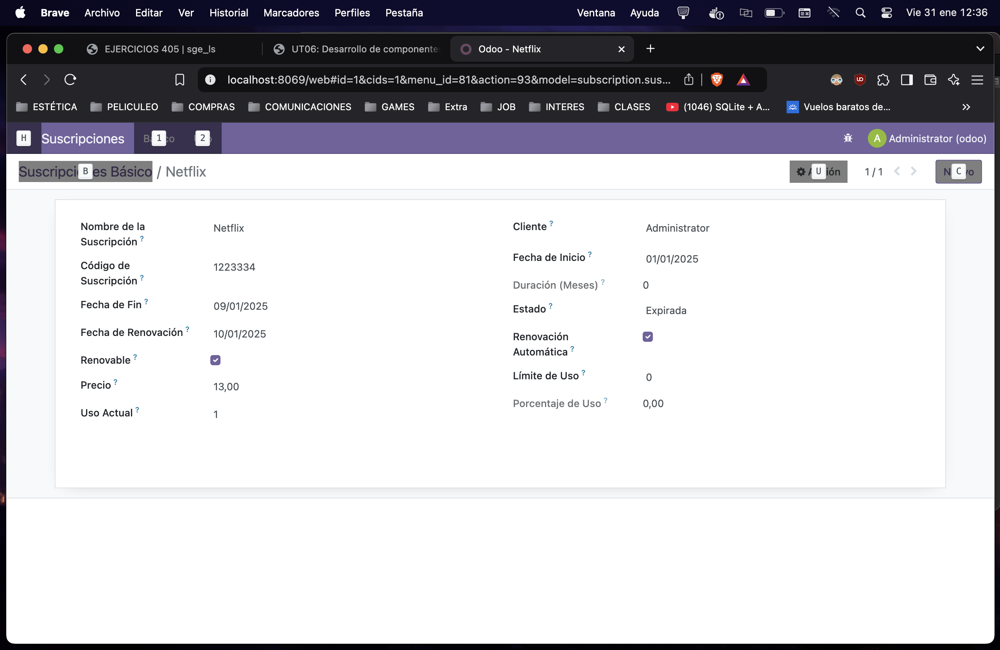
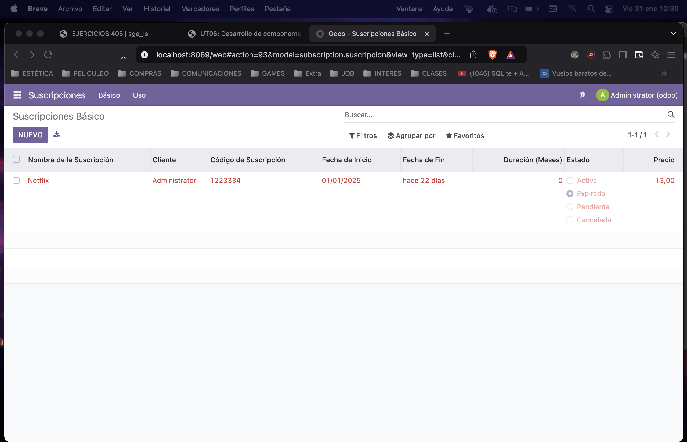
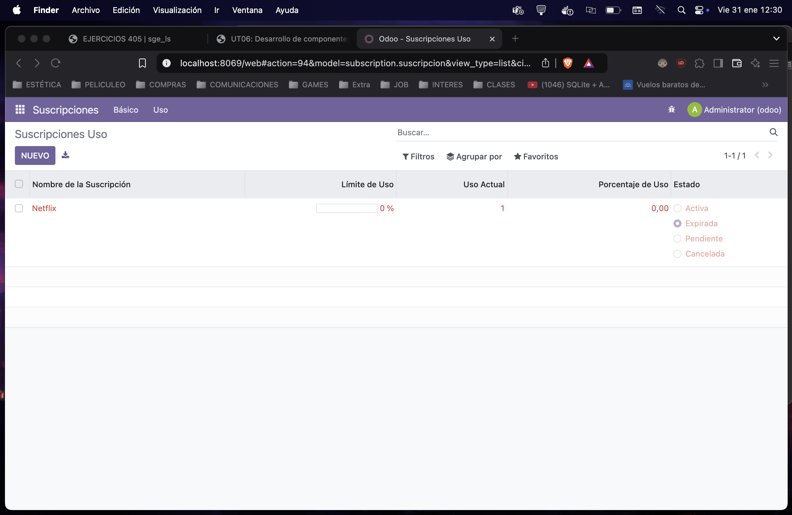

# EJERCICIO 604

# stock_management

### Antes de nada siempre descomento el fichero access en manifest.

## init.py

```python
from . import suscripcion
```

## Modulo Susbscripcion

 ```python
from odoo import models, fields, api
from datetime import timedelta

class Suscripcion(models.Model):
    _name = 'subscription.suscripcion'
    _description = 'Gestión de Suscripciones'

    name = fields.Char(string='Nombre de la Suscripción', required=True)
    customer_id = fields.Many2one('res.partner', string='Cliente', required=True)
    subscription_code = fields.Char(string='Código de Suscripción', required=True)
    start_date = fields.Date(string='Fecha de Inicio', required=True)
    end_date = fields.Date(string='Fecha de Fin')
    duration_months = fields.Integer(string='Duración (Meses)', compute='_compute_duracion_meses', store=True)
    renewal_date = fields.Date(string='Fecha de Renovación')
    status = fields.Selection([
        ('active', 'Activa'),
        ('expired', 'Expirada'),
        ('pending', 'Pendiente'),
        ('cancelled', 'Cancelada')
    ], string='Estado', default='active')
    is_renewable = fields.Boolean(string='Renovable')
    auto_renewal = fields.Boolean(string='Renovación Automática')
    price = fields.Float(string='Precio')
    usage_limit = fields.Integer(string='Límite de Uso')
    current_usage = fields.Integer(string='Uso Actual')
    use_percent = fields.Float(string='Porcentaje de Uso', compute='_compute_porcentaje_uso', store=True)

    @api.depends('start_date', 'end_date')
    def _compute_duracion_meses(self):
        if self.start_date and self.end_date:
            delta = (self.end_date.year - self.start_date.year) * 12 + (self.end_date.month - self.start_date.month)
            self.duration_months = delta
        else:
            self.duration_months = 0

@api.depends('current_usage', 'usage_limit')
def _compute_porcentaje_uso(self):
    if self.usage_limit > 0:
        self.use_percent = (self.current_usage / self.usage_limit) * 100
    else:
        self.use_percent = 0

def action_add_15_days(self):
    if self.end_date:
        self.end_date += timedelta(days=15)
 ```

## ir.model.access.csv

 ```css
id,name,model_id:id,group_id:id,perm_read,perm_write,perm_create,perm_unlink
access_subscription_suscripcion,subscription.suscripcion,model_subscription_suscripcion,base.group_user,1,1,1,1
```
## views.xml

```xml
<?xml version="1.0" encoding="UTF-8"?>
<odoo>
    <record id="view_subscription_tree_basic" model="ir.ui.view">
        <field name="name">subscription.suscripcion.tree.basic</field>
        <field name="model">subscription.suscripcion</field>
        <field name="arch" type="xml">
            <tree string="Suscripciones (Básico)" limit="15" decoration-danger="status == 'expired'" decoration-warning="status == 'cancelled'">
                <field name="name"/>
                <field name="customer_id"/>
                <field name="subscription_code"/>
                <field name="start_date"/>
                <field name="end_date" widget="remaining_days"/>
                <field name="duration_months"/>
                <field name="status" widget="radio"/>
                <field name="price" attrs="{'invisible': [('status', '=', 'cancelled')]}"/>
            </tree>
        </field>
    </record>

    <record id="view_subscription_tree_usage" model="ir.ui.view">
        <field name="name">subscription.suscripcion.tree.usage</field>
        <field name="model">subscription.suscripcion</field>
        <field name="arch" type="xml">
            <tree string="Suscripciones (Uso)" limit="15" decoration-danger="status == 'expired'" decoration-warning="status == 'cancelled'">
                <field name="name"/>
                <field name="usage_limit" widget="progressbar"/>
                <field name="current_usage"/>
                <field name="use_percent" decoration-danger="use_percent > 80"/>
                <field name="status" widget="radio"/>
            </tree>
        </field>
    </record>


<!-- Acciones menu Vista Basica -->
    <record id="action_subscription_basic" model="ir.actions.act_window">
        <field name="name">Suscripciones Básico</field>
        <field name="res_model">subscription.suscripcion</field>
        <field name="view_mode">tree,form</field>
        <field name="view_id" ref="view_subscription_tree_basic"/>
    </record>

<!-- Acciones menu Vista Uso -->
    <record id="action_subscription_usage" model="ir.actions.act_window">
        <field name="name">Suscripciones Uso</field>
        <field name="res_model">subscription.suscripcion</field>
        <field name="view_mode">tree,form</field>
        <field name="view_id" ref="view_subscription_tree_usage"/>
    </record>

    <menuitem id="menu_subscription_root" name="Suscripciones"/>
    <menuitem id="menu_subscription_basic" name="Básico" parent="menu_subscription_root" action="action_subscription_basic"/>
    <menuitem id="menu_subscription_usage" name="Uso" parent="menu_subscription_root" action="action_subscription_usage"/>
</odoo>
```


