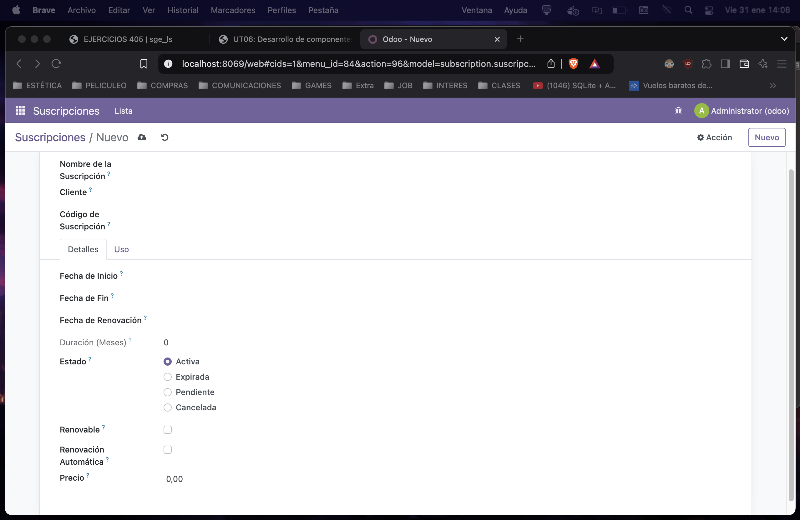

# EJERCICIO 605

# Suscripcion

## views.xml
```xml
<?xml version="1.0" encoding="UTF-8"?>
<odoo>
     <record id="view_subscription_form" model="ir.ui.view">
        <field name="name">subscription.suscripcion.form</field>
        <field name="model">subscription.suscripcion</field>
        <field name="arch" type="xml">
            <form string="Suscripción">
                <sheet>
                    <group>
                        <field name="name"/>
                        <field name="customer_id"/>
                        <field name="subscription_code"/>
                    </group>
                    <notebook>
                        <page string="Detalles">
                            <group>
                                <field name="start_date"/>
                                <field name="end_date"/>
                                <field name="renewal_date"/>
                                <field name="duration_months"/>
                                <field name="status" widget="radio"/>
                                <field name="is_renewable"/>
                                <field name="auto_renewal"/>
                                <field name="price" attrs="{'invisible': [('status', '=', 'cancelled')]}"/>
                            </group>
                        </page>
                        <page string="Uso">
                            <group>
                                <field name="usage_limit"/>
                                <field name="current_usage"/>
                                <field name="use_percent" decoration-danger="use_percent > 80"/>
                            </group>
                        </page>
                    </notebook>
                </sheet>
            </form>
        </field>
    </record>

    <record id="action_subscription_form" model="ir.actions.act_window">
        <field name="name">Suscripción</field>
        <field name="res_model">subscription.suscripcion</field>
        <field name="view_mode">form</field>
        <field name="view_id" ref="view_subscription_form"/>
    </record>


<!-- Acciones menu Vista Basica -->
    <record id="action_subscription_basic" model="ir.actions.act_window">
        <field name="name">Suscripciones Básico</field>
        <field name="res_model">subscription.suscripcion</field>
        <field name="view_mode">tree,form</field>
        <field name="view_id" ref="view_subscription_tree_basic"/>
    </record>

<!-- Acciones menu Vista Uso -->
    <record id="action_subscription_usage" model="ir.actions.act_window">
        <field name="name">Suscripciones Uso</field>
        <field name="res_model">subscription.suscripcion</field>
        <field name="view_mode">tree,form</field>
        <field name="view_id" ref="view_subscription_tree_usage"/>
    </record>

    <menuitem id="menu_subscription_root" name="Suscripciones"/>
    <menuitem id="menu_subscription_basic" name="Básico" parent="menu_subscription_root" action="action_subscription_basic"/>
    <menuitem id="menu_subscription_usage" name="Uso" parent="menu_subscription_root" action="action_subscription_usage"/>
</odoo>
```

 

