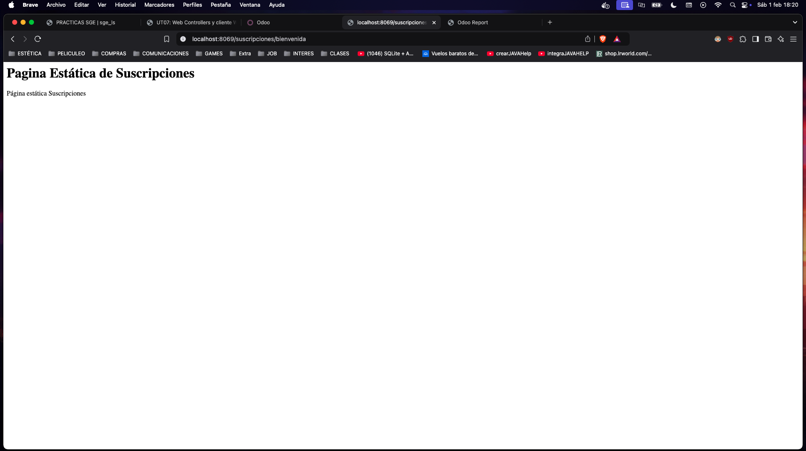
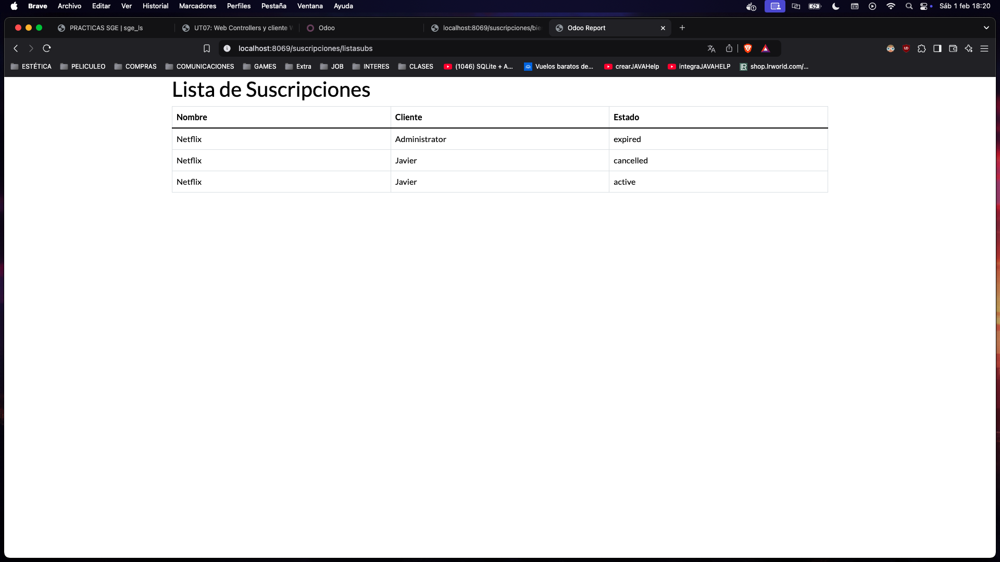

# EJERCICIO 701

# Suscripcion Con Web Statica y Dinámica

## controllers.py

```python
from odoo import http
from odoo.http import request

class MyController(http.Controller):

    @http.route('/suscripciones/bienvenida', auth='public', website=True)
    def welcome_page(self, **kw):
        return "<h1>¡Bienvenido al sistema de suscripciones!</h1><p>Página estática Suscripciones</p>"


class MyController(http.Controller):

    @http.route('/suscripciones/listasubs', auth='public', website=True)
    def subscription_list(self, **kw):
        suscripciones = request.env['subscription.suscripcion'].sudo().search([])
        return request.render('subscription.qwerb_sucripciones', {
            'suscripciones': suscripciones
            })
```
## Views
### subsciption_web.xml

Hago una tabla con todos los valores que quiero mostrar.
Hago un bucle for para iterar sobre todas las suscripciones.

```xml
<?xml version="1.0" encoding="UTF-8"?>
<odoo>
    <template id="qwerb_sucripciones" name="Listado de Suscripciones">
        <t t-call="web.html_container">
            <div class="container">
                <h1>Lista de Suscripciones</h1>
                <table class="table table-bordered">
                    <thead>
                        <tr>
                            <th>Nombre</th>
                            <th>Cliente</th>
                            <th>Estado</th>
                        </tr>
                    </thead>
                    <tbody>
                        <t t-foreach="suscripciones" t-as="suscripcion">
                            <tr>
                                <td><t t-esc="suscripcion.name"/></td>
                                <td><t t-esc="suscripcion.customer_id.name"/></td>
                                <td><t t-esc="suscripcion.status"/></td>
                            </tr>
                        </t>
                    </tbody>
                </table>
            </div>
        </t>
    </template>
</odoo>

```


