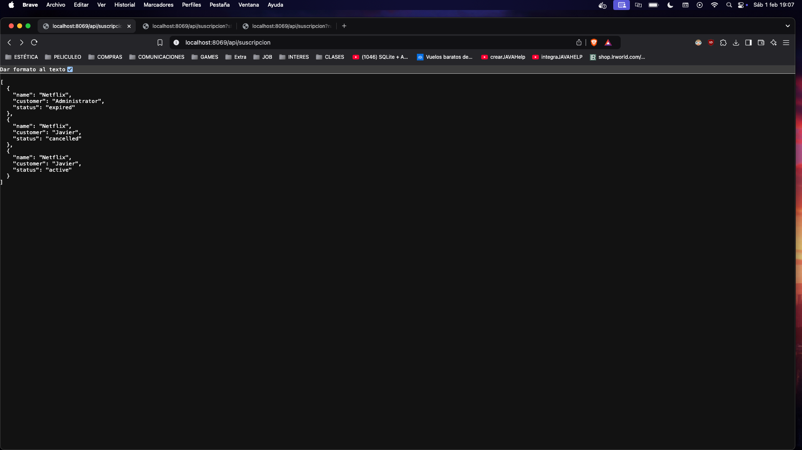
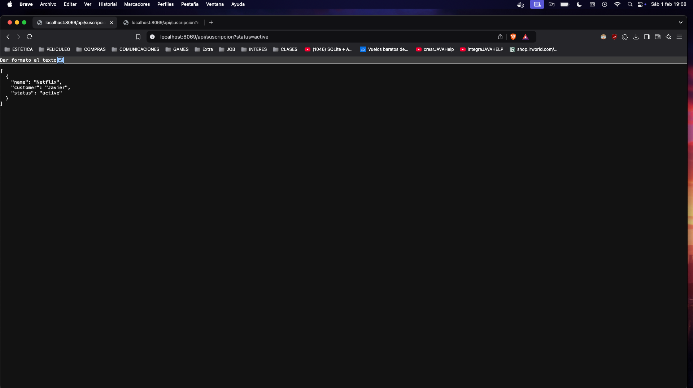
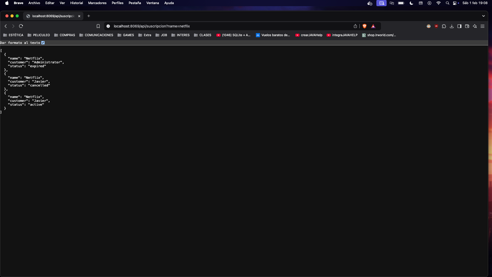

# EJERCICIO 702

# Suscripcion Con Api Rest

## subscriptionController.py

```python
from odoo import http
from odoo.http import request, Response
import json

class SubscriptionController(http.Controller):

    @http.route('/api/suscripcion', type='http', auth='public', methods=['GET'])
    def get_all_subscriptions(self, **kwargs):
        status = kwargs.get('status')
        allowed_statuses = ['active', 'expired', 'pending', 'cancelled']

        if status and status not in allowed_statuses:
            return Response(
                json.dumps({"error": "Estado no válido. Valores permitidos: active, expired, pending, cancelled"}),
                status=400,
                content_type='application/json'
            )

        domain = [('status', '=', status)] if status else []
        subscriptions = request.env['subscription.suscripcion'].sudo().search(domain)

        data = [{
            'name': sub.name,
            'customer': sub.customer_id.name,
            'status': sub.status
        } for sub in subscriptions]

        return Response(json.dumps(data), content_type='application/json')

    @http.route('/api/suscription/<string:name>', type='http', auth='public', methods=['GET'])
    def get_subscription_by_name(self, name):
        subscription = request.env['subscription.suscripcion'].sudo().search([('name', '=', name)], limit=1)

        if not subscription:
            return Response(
                json.dumps({"error": "Suscripción no encontrada"}),
                status=404,
                content_type='application/json'
            )

        data = {
            'name': subscription.name,
            'customer': subscription.customer_id.name,
            'subscription_code': subscription.subscription_code,
            'start_date': str(subscription.start_date),
            'end_date': str(subscription.end_date) if subscription.end_date else None,
            'duration_months': subscription.duration_months,
            'renewal_date': str(subscription.renewal_date) if subscription.renewal_date else None,
            'status': subscription.status,
            'is_renewable': subscription.is_renewable,
            'auto_renewal': subscription.auto_renewal,
            'price': subscription.price,
            'usage_limit': subscription.usage_limit,
            'current_usage': subscription.current_usage,
            'use_percent': subscription.use_percent
        }

        return Response(json.dumps(data), content_type='application/json')
```


## Views
### subsciption_web.xml

## Muestra todas las suscripciones


## Muestra todas las suscripciones por estado


## Muestra todas las suscripciones por nombre
